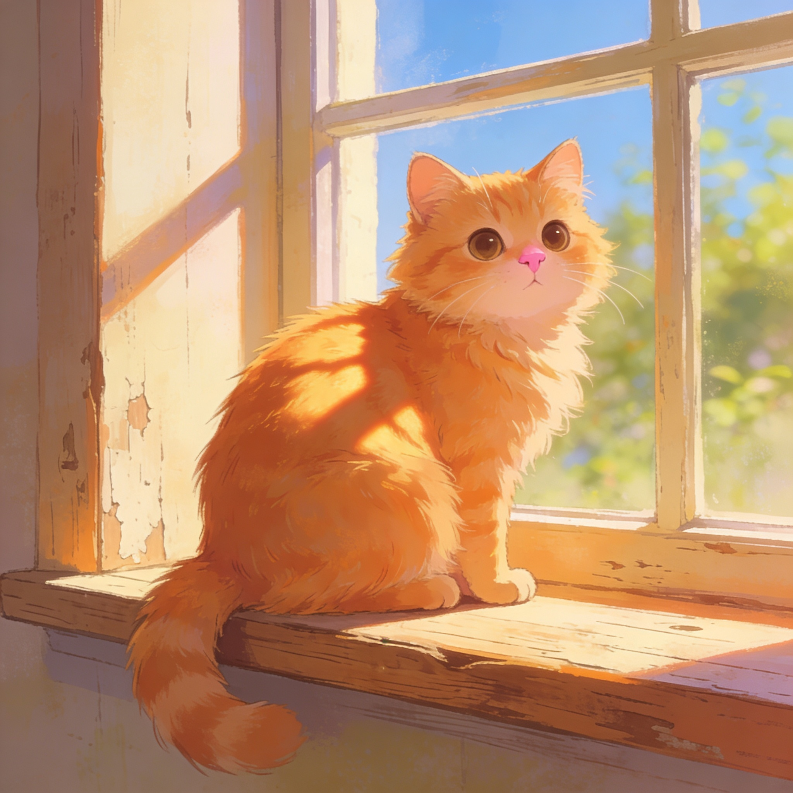

# Примеры генерации изображений

Примеры сгенерированы через плагин `image_gen/polza` в Hermes Agent.

## Seedream 4.5 (дефолтная модель)

```
Промпт: "mountain landscape with cherry blossoms, photorealistic"
Аспект: square (1:1)
Цена: 5 ₽
```



---

## Z-Image (Tongyi) — самая дешёвая

```
Промпт: "mountain lake"
Аспект: square (1:1)
Цена: 1.40 ₽
```


---

## Grok Imagine (через Polza)

```
Промпт: "cute cat"
Аспект: landscape (3:2)
Цена: 2.50 ₽
```


---

## Nano Banana 2 (Gemini 3.1 Flash)

```
Промпт: "sunset beach"
Аспект: portrait (9:16)
Цена: 4.80 ₽ (1K)
```


---

## GPT-5.4 Image 2

```
Промпт: "mountain lake"
Аспект: landscape (16:9)
Цена: 4 ₽ (1K)
```


---

## Seedream 5 Lite

```
Промпт: "forest path"
Аспект: square (1:1)
Цена: 4 ₽
```


---

## Подключенные плагины

Также доступно **xAI** (встроенный плагин `image_gen/xai`):

| Модель | Цена |
|--------|------|
| **Grok Imagine Image** | Включено в подписку xAI/Grok |
| **Grok Imagine Image (Quality)** | То же |
