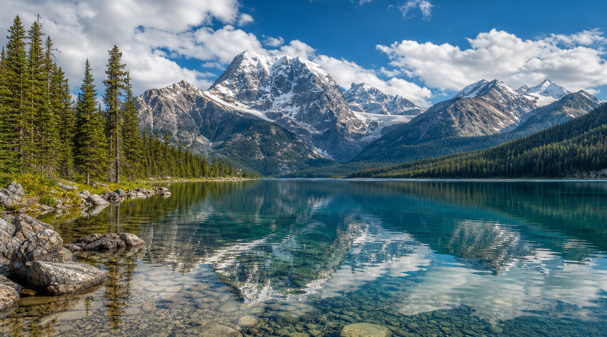
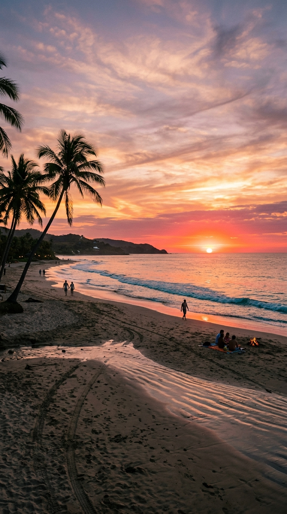
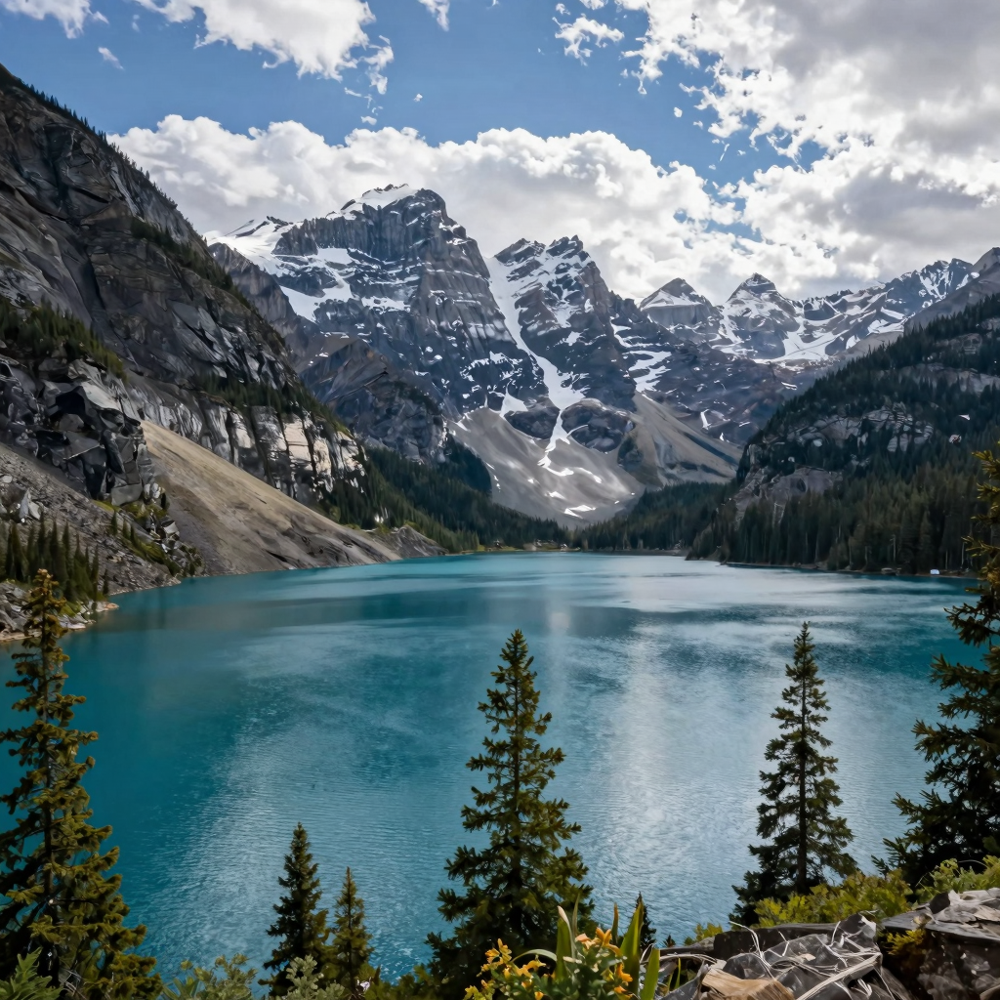
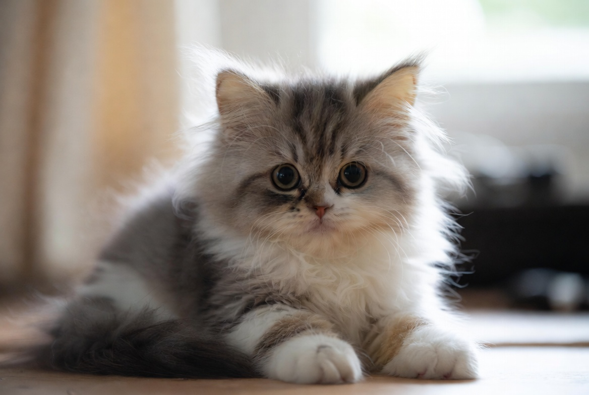

# Примеры генерации изображений

Примеры сгенерированы через плагин `image_gen/polza` в Hermes Agent. Все картинки реальные — сгенерированы и оплачены через Polza AI.

## Seedream 4.5 (дефолтная)

```
Промпт: "a cute orange cat sitting on a windowsill, digital art"
Аспект: square (1:1)
Цена: 5 ₽
```


---

## GPT Image 1.5

```
Промпт: "a cute cat wearing a hat"
Аспект: square (1:1)
Цена: 3 ₽ (medium)
```


---

## GPT-5.4 Image 2

```
Промпт: "mountain lake"
Аспект: landscape (16:9), 1K
Цена: 4 ₽
```



---

## FLUX 2 Pro

```
Промпт: "mountain landscape with cherry blossoms"
Аспект: landscape (16:9), 1K
Цена: 5 ₽
```


---

## Nano Banana 2 (Gemini 3.1 Flash)

```
Промпт: "sunset beach"
Аспект: portrait (9:16), 1K
Цена: 4.80 ₽
```



---

## Seedream 5 Lite

```
Промпт: "forest path"
Аспект: square (1:1)
Цена: 4 ₽
```


---

## Z-Image (Tongyi) — самая дешёвая

```
Промпт: "mountain lake"
Аспект: square (1:1)
Цена: 1.40 ₽
```



---

## Grok Imagine (через Polza)

```
Промпт: "cute cat"
Аспект: landscape (3:2)
Цена: 2.50 ₽
```


